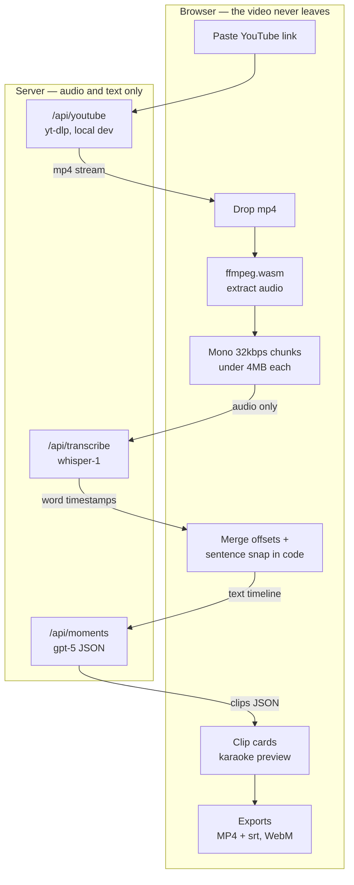
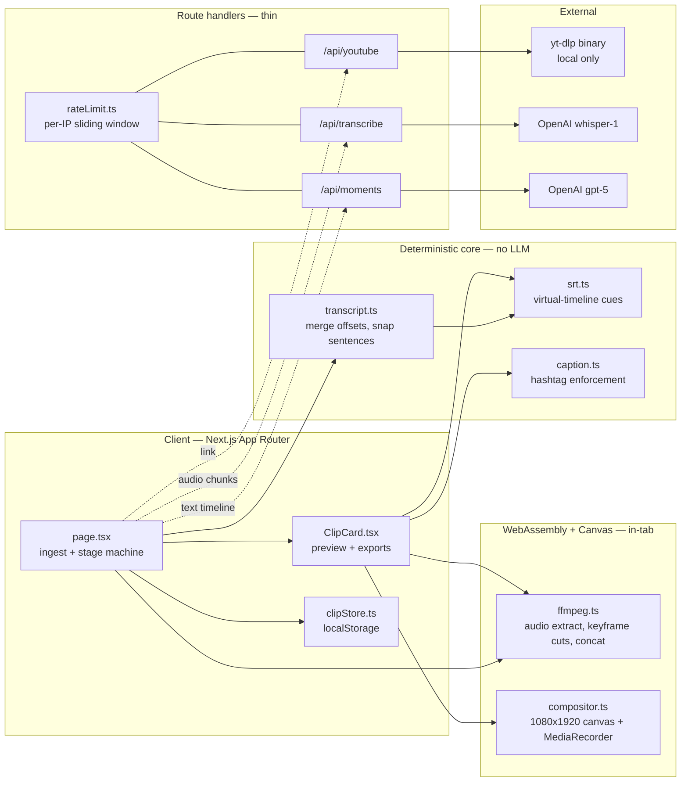
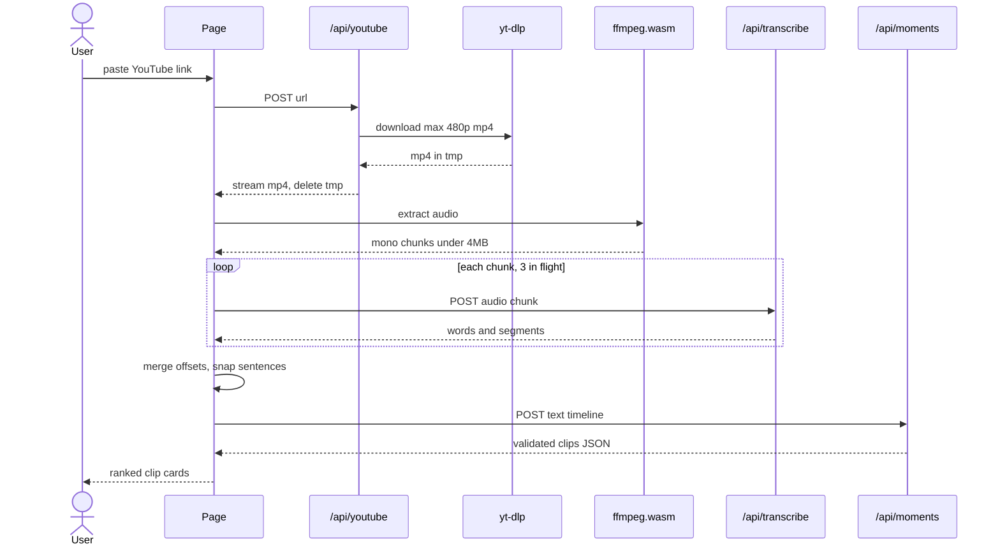

# HookShot

Drop a video — or paste a YouTube link — and get back ranked, captioned, ready-to-post vertical clips. Podcasts, pressers, interviews, VODs, streams. Built in an 8-hour hackathon.

**Why it's different:** the video never leaves your browser. Every other clip tool uploads your file to a server farm. HookShot runs ffmpeg.wasm in the tab, rips the audio locally, and only ships compressed audio chunks (under 4MB each) and text to the API. Cutting, caption burning, and rendering all happen client-side. No storage, no upload queue, no 2GB file crawling over your uplink — and it fits inside Vercel's 4.5MB body limit by design.

## Pipeline



## Architecture



Dotted edges are the only network hops, and none of them carries the source video: a link goes out, audio chunks and text go out, JSON comes back. Everything that touches the video pixels — extraction, cutting, concatenation, caption burning — lives in the WASM and canvas layer inside the tab.

The split is strict: the LLM only classifies moments and writes copy. All deterministic math — chunk offsets, timestamp merging, sentence snapping, .srt timing — lives in code. The model proposes rough clip bounds; the client snaps them. Model output arrives in JSON mode and every field is validated and coerced server-side (clamped scores, in-bounds timestamps, cautious defaults for missing compliance data).

## Quickstart

```bash
git clone <repo-url> && cd cursor_hackathon
cp .env.example .env.local     # add your OPENAI_API_KEY
brew install yt-dlp            # optional — enables paste-a-link ingest
npm install
npm run dev
```

Open http://localhost:3000, drop an mp4 or paste a YouTube URL. Verify a change with `npx tsc --noEmit` and `npm run build`.

## Ingest

Two paths in:

- **Paste a link.** `/api/youtube` shells out to locally-installed yt-dlp, pulls a ≤480p mp4 (capped at 500MB), and streams it straight to the browser — the server keeps nothing. `ytsearch1:` search refs work too ("ytsearch1: ufc 329 press conference"). This only works where yt-dlp is installed; the UI checks availability on load and hides the URL bar when it's absent.
- **Drag and drop.** Any mp4. For YouTube sources on machines without the app running, `scripts/fetch.sh <url> [section]` is the manual fallback — it downloads with yt-dlp (supports `--download-sections` for long streams) and you drop the result in.

## What you get

- 5–8 clips ranked by virality score (hook, emotion, quotability, loopability), each with a hook title, first-3-seconds hook line, and a ready-to-paste caption with hashtags
- **Audience-aware copy** — name your target audience or leave it blank and the model infers who would share this from the transcript
- **~20s sweet spot**, 60s max target, 120s hard cap enforced in code
- **Jump-cut assemblies** — when trimming dead air makes a clip hit harder, 1–3 non-adjacent spans of the same arc get stitched with fast white-flash transitions
- **Word-level karaoke captions** from whisper-1 word timestamps, previewed live on every clip card
- Clip library persisted in localStorage across videos
- Per-IP sliding-window rate limiting on all three API routes (`lib/rateLimit.ts`)

## Exports

Everything renders client-side. No logos, no watermarks, ever.

| Format | What it is | How it's made |
|---|---|---|
| MP4 + .srt | Instant lossless cut at source resolution, sidecar subtitles | ffmpeg.wasm keyframe-aligned `-c copy`; the .srt is timed against the cut's virtual timeline (jump cuts included), so captions line up exactly |
| WebM 1080×1920 | Vertical short with burned-in karaoke captions, hook title overlay (first 3s), progress bar | Canvas compositor + MediaRecorder — full frame contained over a blurred cover fill, nothing cropped |

## Campaign mode

HookShot is general-purpose, but it ships with a UFC 329 (McGregor vs Holloway 2) campaign brain that auto-activates when the content is fight promo around that card. In campaign mode each clip is tagged with one of nine storylines (McGregor's return at 170, Holloway, Saint-Denis, Pimblett, Royval, Kavanagh, Green–McKinney, Whittaker, Steveson), every caption ends with `#UFCClips` — appended in code, not just requested in the prompt — and each clip carries honest compliance flags (`in_fight_broadcast_risk`, `walkout_risk`, `low_value_risk`) rendered as warning banners. Non-campaign content gets niche-appropriate hashtags and no `#UFCClips`.

## Happy path: paste a link



## Deploy to Vercel

1. Import the repo, set `OPENAI_API_KEY` in the Vercel environment.
2. Deploy. That's it — no storage, no queues, no video ever hits a function.

The YouTube pull is **local-dev only**: Vercel has no yt-dlp and YouTube blocks datacenter IPs anyway. The UI detects this automatically and hides the URL bar, leaving drag-and-drop (use `scripts/fetch.sh` locally to grab sources). Re-test the full pipeline after deploying — prod route body and duration limits differ from dev.

## Stack

Next.js 16 (App Router), React 19, Tailwind 4, strict TypeScript. `@ffmpeg/ffmpeg` with a self-hosted single-thread core in `public/ffmpeg/` (no COOP/COEP headers needed), lazy-loaded after file drop. OpenAI `whisper-1` for transcription, `gpt-5` for moments with `gpt-5-mini` fallback.

Key files: `app/page.tsx` (ingest + pipeline + clip grid), `components/ClipCard.tsx`, `lib/ffmpeg.ts` (audio extraction, keyframe-aligned cuts), `lib/compositor.ts` (9:16 canvas renderer), `lib/transcript.ts` (merge + snap), `lib/srt.ts`, `app/api/{youtube,transcribe,moments}/route.ts`.

## Limitations

- **WebM export is Chrome-first.** It rides on MediaRecorder, which is flaky in Safari. The MP4 + .srt path works everywhere.
- **MP4 cuts start on a keyframe.** Stream copy can only begin at the keyframe at or before the requested start; HookShot probes it and times the .srt against the real start, but the clip may open up to a couple seconds early.
- **Function timeouts on the Vercel hobby plan** can undercut the routes' `maxDuration = 300` — long transcripts may need a paid plan or shorter chunks.
- **The rate limiter is in-memory and per-instance.** On serverless, each warm instance keeps its own window. It stops a single client from hammering your OpenAI budget; it is not a distributed defense.
- **ffmpeg.wasm holds the whole file in memory** — link pulls are capped at 500MB and very long sources will strain the tab. Trim first (`fetch.sh` supports sections).
